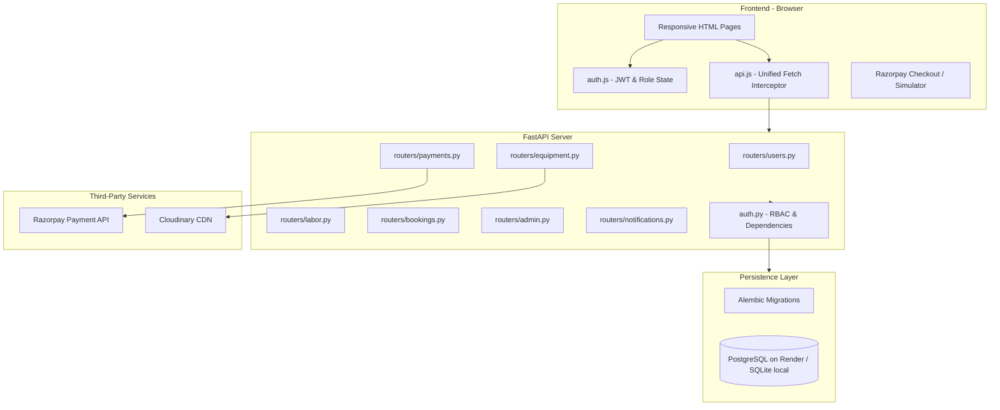
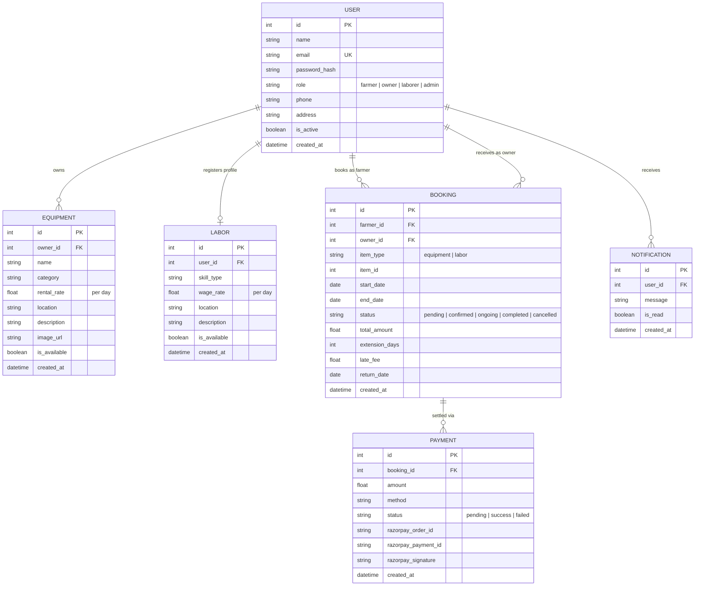
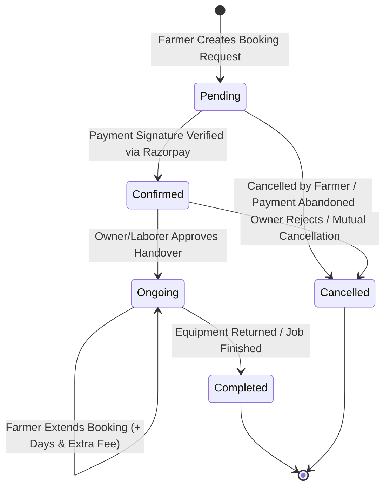

# 🌾 KhetSaathi (खेती साथी)
### Farm Equipment & Agricultural Labor Sharing System

[](https://www.python.org/)
[](https://fastapi.tiangolo.com)
[](https://www.sqlalchemy.org/)
[](https://getbootstrap.com/)
[](LICENSE)
[-brightgreen.svg)](backend/tests/)

**KhetSaathi** is a full-stack, production-ready web platform engineered to address the critical challenges of agricultural mechanization and labor shortages across India. By offering a transparent, role-based sharing economy for tractors, combine harvesters, seeders, land levelers, and skilled farm operators, KhetSaathi helps smallholder farmers reduce upfront capital expenditure by up to 40% while generating steady rental revenue for machinery owners.

---

## 📑 Table of Contents
1. [Key Features & System Highlights](#-key-features--system-highlights)
2. [Tech Stack](#-tech-stack)
3. [System Architecture](#-system-architecture)
4. [Data Model & ER Diagram](#-data-model--er-diagram)
5. [Booking State Machine](#-booking-state-machine)
6. [Role-Based Access Control (RBAC)](#-role-based-access-control-rbac)
7. [Requirements Engineering Compliance (SRS Req 1–10)](#-requirements-engineering-compliance)
8. [Local Development & Setup Guide](#-local-development--setup-guide)
9. [Pre-configured Demo Accounts](#-pre-configured-demo-accounts)
10. [Automated Test Suite (pytest)](#-automated-test-suite-pytest)
11. [Payment Gateway (Razorpay) Workflow](#-payment-gateway-razorpay-workflow)
12. [Cloudinary Image Storage & Local Fallback](#-cloudinary-image-storage--local-fallback)
13. [Production Deployment Guides](#-production-deployment-guides)
    - [Backend & Database on Render.com](#deploying-to-rendercom)
    - [Frontend on Netlify](#deploying-frontend-to-netlify)
14. [Project Structure](#-project-structure)

---

## 🚀 Key Features & System Highlights

- **Bilingual & Rural UX**: Designed with high-contrast elements, visual iconography, and Hindi/English subtitles (`खेती साथी`) for accessibility across literacy levels.
- **Zero-Conflict Concurrency Safeguards**: Database transaction locking prevents double-booking of machinery on overlapping dates.
- **Dynamic Booking State Machine**: Transitions through `Pending` $\rightarrow$ `Confirmed` $\rightarrow$ `Ongoing` $\rightarrow$ `Completed` (or `Cancelled`), supporting date extensions and automated late fee penalty calculations.
- **Secure Dual-Mode Payments**: Integrates Razorpay with cryptographic HMAC-SHA256 signature verification, complemented by an interactive test mode sandbox simulator for zero-friction local evaluations.
- **Comprehensive RBAC**: Four distinct user roles (`Farmer`, `Equipment Owner`, `Laborer`, `Admin`) strictly guarded by JWT Bearer tokens.
- **Live In-App Notifications**: Real-time alerts for booking creation, payment confirmation, owner approval, return receipts, and late penalties.

---

## 🛠 Tech Stack

| Layer | Technology | Description |
| :--- | :--- | :--- |
| **Backend Framework** | **FastAPI** (Python) | High-performance async ASGI REST API with auto Swagger/OpenAPI docs |
| **ORM & Database** | **SQLAlchemy 2.0** & **Alembic** | Type-safe ORM with automated schema migration management |
| **Database Engines** | **PostgreSQL** / **SQLite** | PostgreSQL in production (Render) with seamless local SQLite fallback |
| **Authentication** | **JWT (`python-jose`)** & **Bcrypt** | Industry-standard token authentication and cryptographic password hashing |
| **Input Validation** | **Pydantic v2** | Strict schema validation, sanitization, and type checking |
| **Frontend** | **HTML5, CSS3, Vanilla JS** | Lightweight, dependency-free client with Bootstrap 5 & Bootstrap Icons |
| **Payment Gateway** | **Razorpay SDK** | Test mode order creation and HMAC-SHA256 signature verification |
| **Media Storage** | **Cloudinary** | Cloud image uploads with fallback to local persistent disk storage |
| **Testing** | **pytest** & **HTTPX** | 18 unit and integration tests covering auth, bookings, payments, and RBAC |

---

## 🏛 System Architecture



---

## 📊 Data Model & ER Diagram



---

## 🔄 Booking State Machine



### Late Fee Calculation Formula:
$$\text{Late Fee} = \max(0, (\text{Actual Return Date} - \text{Scheduled End Date}).\text{days}) \times (\text{Daily Rate} \times 1.5)$$

---

## 🔒 Role-Based Access Control (RBAC)

| Endpoint | Method | Allowed Roles | Description |
| :--- | :--- | :--- | :--- |
| `/api/users/register` | POST | Public | Anyone can register as Farmer, Owner, or Laborer |
| `/api/users/login` | POST | Public | Authenticates credentials and returns signed JWT token |
| `/api/equipment` | GET | Public | Search and browse machinery with multi-parameter filters |
| `/api/equipment` | POST | `owner`, `admin` | Add new machinery listing (with optional image upload) |
| `/api/equipment/{id}` | PUT, DELETE | `owner` (Self), `admin` | Update or remove machinery with strict ownership check |
| `/api/labor` | GET | Public | Search available agricultural laborers |
| `/api/labor` | POST, PUT | `laborer` (Self), `admin`| Create or update laborer skill profile |
| `/api/bookings` | POST | `farmer`, `admin` | Reserve machinery/labor with conflict prevention |
| `/api/bookings/{id}/status` | PATCH | `owner` (Self), `admin`| Approve handover (`ongoing`), mark `completed`, or cancel |
| `/api/bookings/{id}/extend` | POST | `farmer` (Self), `admin`| Extend active booking by 1–30 days |
| `/api/bookings/{id}/return` | POST | `owner`, `farmer`, `admin`| Return equipment with automatic late fee assessment |
| `/api/payments/verify` | POST | `farmer`, `admin` | Verify Razorpay HMAC-SHA256 signature |
| `/api/admin/*` | ALL | `admin` | Platform statistics, user suspension, and system audits |

---

## 📋 Requirements Engineering Compliance

| SRS Req ID | Specification Requirement | KhetSaathi Implementation Details |
| :--- | :--- | :--- |
| **Req 1** | **User Registration & Login** | Role selection (Farmer, Owner, Laborer); Bcrypt password hashing; JWT token issuance with 24h expiration. |
| **Req 2** | **Equipment Booking & Return** | Search by keyword, category, location, rate; date-range booking; conflict checks; extension API; return API with $1.5\times$ late fee. |
| **Req 3** | **Labor Hiring** | Skill directory; daily wage filter; availability toggle; date-range booking. |
| **Req 4** | **Manage Listings** | Owners CRUD equipment; Laborers update skill profile; real-time availability switches. |
| **Req 5** | **Razorpay Payment Gateway** | Order creation; Razorpay Checkout SDK; backend HMAC-SHA256 verification; sandbox simulator fallback. |
| **Req 6** | **In-App Notifications** | Auto-alerts on booking, payment success, owner handover, and returns; unread badge counter. |
| **Req 7** | **Security & Encryption** | Bcrypt hashing; JWT Bearer authorization; Pydantic input sanitization; ownership guards. |
| **Req 8** | **Usability & Accessibility** | Responsive Bootstrap 5 UI; clear typography; high contrast badges; Hindi/English labels; 1-click demo logins. |
| **Req 9** | **Reliability & Error Handling** | Global exception handlers prevent raw trace exposure; detailed FAQ with terms and policies. |
| **Req 10** | **Portability** | Zero OS-dependent code; runs on macOS, Linux (Render), Windows; PostgreSQL and SQLite support. |

---

## 💻 Local Development & Setup Guide

### Prerequisites
- Python 3.10+ (Tested up to Python 3.14)
- Git & modern web browser

### Step 1: Clone Repository & Create Virtual Environment
```bash
git clone https://github.com/your-username/khetsaathi.git
cd khetsaathi

# Create virtual environment
python3 -m venv .venv

# Activate virtual environment
# On macOS/Linux:
source .venv/bin/activate
# On Windows (cmd/powershell):
# .venv\Scripts\activate
```

### Step 2: Install Dependencies
```bash
pip install -r backend/requirements.txt
```

### Step 3: Configure Environment Variables
```bash
cp backend/.env.example backend/.env
```
*(Default settings use SQLite `sqlite:///./khetsaathi.db` for instant local execution without needing to install PostgreSQL).*

### Step 4: Run Database Migrations
```bash
cd backend
alembic upgrade head
cd ..
```

### Step 5: Seed Sample Agricultural Data
Populate realistic demo users, equipment listings, labor profiles, and existing bookings:
```bash
python backend/seed_data.py
```

### Step 6: Start the Server
```bash
# From project root:
uvicorn backend.app.main:app --reload --port 8000
```
Open your browser at **[http://localhost:8000](http://localhost:8000)**.
The FastAPI server serves both the JSON API and all frontend pages (`index.html`, `equipment.html`, `labor.html`, `bookings.html`, `dashboard.html`, `faq.html`).

Interactive API Documentation (Swagger): **[http://localhost:8000/docs](http://localhost:8000/docs)**.

---

## 👥 Pre-configured Demo Accounts

For instant grading and portfolio demonstration, the login page features **1-Click Demo Fill Buttons**:

| Role | Email | Password | Name & Location |
| :--- | :--- | :--- | :--- |
| **Farmer** (Seeker) | `farmer@khetsaathi.com` | `farmer123` | Ramesh Kumar (Karnal, Haryana) |
| **Equipment Owner** | `owner@khetsaathi.com` | `owner123` | Sardar Harpreet Singh (Ludhiana, Punjab) |
| **Farm Laborer** | `laborer@khetsaathi.com` | `labor123` | Sunita Devi (Meerut, Uttar Pradesh) |
| **Platform Admin** | `admin@khetsaathi.com` | `admin123` | Admin Administrator (New Delhi HQ) |

---

## 🧪 Automated Test Suite (pytest)

KhetSaathi includes 18 unit and integration tests covering the SRS Test Cases:
- **Registration**: Valid signup, duplicate email rejection (400)
- **Booking**: Valid booking creation, start-after-end date validation (422), overlap conflict detection (409)
- **Payment**: Razorpay order generation, valid signature verification (200), invalid signature rejection (400)
- **State Transitions**: Owner approval (`confirmed` $\rightarrow$ `ongoing`), late fee calculation on overdue return
- **RBAC**: Farmer blocked from owner-only routes (403), unauthenticated blocked (401), owner blocked from modifying foreign listings (403)

To run the complete test suite:
```bash
PYTHONPATH=backend pytest backend/tests/ -v
```

Expected Output:
```
backend/tests/test_auth.py::test_register_valid_user PASSED              [  5%]
backend/tests/test_auth.py::test_register_duplicate_email_rejected PASSED [ 11%]
backend/tests/test_auth.py::test_login_valid_credentials PASSED          [ 16%]
backend/tests/test_auth.py::test_login_invalid_password PASSED           [ 22%]
backend/tests/test_auth.py::test_get_current_user_profile PASSED         [ 27%]
backend/tests/test_bookings.py::test_create_booking_valid PASSED         [ 33%]
backend/tests/test_bookings.py::test_booking_end_before_start_rejected PASSED [ 38%]
backend/tests/test_bookings.py::test_booking_conflict_overlap_rejected PASSED [ 44%]
backend/tests/test_bookings.py::test_owner_approve_booking PASSED        [ 50%]
backend/tests/test_bookings.py::test_late_fee_calculation_on_return PASSED [ 55%]
backend/tests/test_payments.py::test_create_razorpay_order PASSED        [ 61%]
backend/tests/test_payments.py::test_payment_signature_verification_success PASSED [ 66%]
backend/tests/test_payments.py::test_payment_signature_verification_failure PASSED [ 72%]
backend/tests/test_rbac.py::test_unauthenticated_request_blocked PASSED  [ 77%]
backend/tests/test_rbac.py::test_farmer_blocked_from_owner_endpoint PASSED [ 83%]
backend/tests/test_rbac.py::test_farmer_blocked_from_admin_endpoint PASSED [ 88%]
backend/tests/test_rbac.py::test_admin_allowed_access_to_admin_endpoint PASSED [ 94%]
backend/tests/test_rbac.py::test_owner_cannot_modify_other_owner_equipment PASSED [100%]

====================== 18 passed in 11.52s =======================
```

---

## 💳 Payment Gateway (Razorpay) Workflow

1. **Order Creation (`POST /api/payments/create-order`)**:
   - Backend calculates exact amount in paise ($₹ \times 100$).
   - Calls Razorpay Order API or generates a structured sandbox order ID (`order_test_<id>_<uuid>`).
2. **Client Checkout**:
   - If real Razorpay test keys (`rzp_test_...`) are provided in `.env`, the Razorpay Checkout modal appears.
   - If placeholder test keys are active, KhetSaathi displays an interactive **Sandbox Simulator Modal**, enabling testers to simulate either a successful or failed payment without credentials.
3. **Signature Verification (`POST /api/payments/verify`)**:
   - Backend computes HMAC-SHA256 signature:
     $$\text{Signature} = \text{HMAC-SHA256}(\text{order\_id} + \text{"\|"} + \text{payment\_id}, \text{RAZORPAY\_KEY\_SECRET})$$
   - On valid signature, booking is marked `Confirmed` and payment is marked `Success`.
   - On forged or invalid signature, payment is marked `Failed` and rejected with HTTP 400.

---

## ☁️ Cloudinary Image Storage & Local Fallback

- If `CLOUDINARY_CLOUD_NAME`, `CLOUDINARY_API_KEY`, and `CLOUDINARY_API_SECRET` are present, images uploaded via the Owner Dashboard are stored on Cloudinary CDN.
- If running without Cloudinary keys, the application gracefully writes files to `backend/uploads/` and serves them via `/uploads/<filename>`.
- Owners can also supply direct image URLs (e.g. Unsplash agricultural stock photos).

---

## 🚀 Production Deployment Guides

### Deploying to Render.com

1. **Create a Free PostgreSQL Database**:
   - In Render Dashboard, click **New +** $\rightarrow$ **PostgreSQL**.
   - Note the **Internal Database URL** (or External URL).

2. **Deploy Backend Web Service**:
   - Click **New +** $\rightarrow$ **Web Service**.
   - Connect your GitHub repository.
   - **Environment**: `Python 3`
   - **Build Command**:
     ```bash
     pip install -r backend/requirements.txt && cd backend && alembic upgrade head && python seed_data.py
     ```
   - **Start Command**:
     ```bash
     cd backend && uvicorn app.main:app --host 0.0.0.0 --port $PORT
     ```
   - **Environment Variables**:
     - `DATABASE_URL`: Your Render PostgreSQL database connection string
     - `SECRET_KEY`: A secure 64-character random string
     - `ENVIRONMENT`: `production`
     - `RAZORPAY_KEY_ID`: Your Razorpay Key ID
     - `RAZORPAY_KEY_SECRET`: Your Razorpay Key Secret
     - `CLOUDINARY_CLOUD_NAME`: (Optional) Your Cloudinary Cloud Name
     - `CLOUDINARY_API_KEY`: (Optional) Your Cloudinary API Key
     - `CLOUDINARY_API_SECRET`: (Optional) Your Cloudinary API Secret

### Deploying Frontend to Netlify (Optional)

Since FastAPI already serves the frontend static files automatically, a separate Netlify deployment is optional. However, if you prefer deploying the frontend separately:

1. In Netlify, click **Add new site** $\rightarrow$ **Import an existing project**.
2. Set **Publish directory** to `frontend`.
3. Create a `frontend/_redirects` file to proxy backend API calls:
   ```
   /api/*  https://your-render-service.onrender.com/api/:splat  200
   /uploads/* https://your-render-service.onrender.com/uploads/:splat 200
   ```
4. Deploy!

---

## 📁 Project Structure

```
khetsaathi/
├── backend/
│   ├── alembic/                      # Database migration scripts & env.py
│   │   ├── versions/
│   │   └── env.py
│   ├── app/                          # Core FastAPI Application
│   │   ├── __init__.py
│   │   ├── config.py                 # Pydantic Settings & environment loader
│   │   ├── database.py               # SQLAlchemy engine & session dependency
│   │   ├── models.py                 # ORM entities (User, Equipment, Labor, Booking, Payment, Notif)
│   │   ├── schemas.py                # Pydantic v2 validation models
│   │   ├── auth.py                   # Bcrypt hashing & JWT RBAC dependencies
│   │   ├── cloudinary_util.py        # Cloudinary uploader with local disk fallback
│   │   ├── routers/
│   │   │   ├── __init__.py
│   │   │   ├── users.py              # Register, login, profile endpoints
│   │   │   ├── equipment.py          # Machinery search, filter, and CRUD
│   │   │   ├── labor.py              # Labor directory and profiles
│   │   │   ├── bookings.py           # Concurrency-safe booking state machine
│   │   │   ├── payments.py           # Razorpay order & HMAC verification
│   │   │   ├── notifications.py      # In-app alerts & unread counters
│   │   │   └── admin.py              # Platform metrics & audit logs
│   │   └── main.py                   # ASGI app setup, CORS, and static file mounts
│   ├── tests/                        # Pytest Automated Test Suite
│   │   ├── __init__.py
│   │   ├── conftest.py               # Fixtures with in-memory SQLite & mock tokens
│   │   ├── test_auth.py              # Auth & registration tests
│   │   ├── test_bookings.py          # Booking dates, conflict & late fee tests
│   │   ├── test_payments.py          # Signature verification tests
│   │   └── test_rbac.py              # RBAC security enforcement tests
│   ├── uploads/                      # Local image uploads directory (.gitkeep)
│   ├── alembic.ini                   # Alembic configuration
│   ├── requirements.txt              # Production Python package requirements
│   ├── seed_data.py                  # Database seeder with realistic sample records
│   └── .env.example                  # Environment configuration template
├── frontend/
│   ├── index.html                    # Homepage with hero & featured listings
│   ├── equipment.html                # Machinery search, filter & booking modal
│   ├── labor.html                    # Labor directory & hiring modal
│   ├── bookings.html                 # Booking tracker with progress stepper & pay modal
│   ├── dashboard.html                # Role-adaptive control panel
│   ├── login.html                    # Login form with 1-click demo accounts
│   ├── register.html                 # Sign-up with interactive role picker
│   ├── faq.html                      # Comprehensive help & policies
│   ├── css/
│   │   └── style.css                 # Custom agricultural design system
│   └── js/
│       ├── api.js                    # Unified Fetch client & formatters
│       ├── auth.js                   # Dynamic navbar & session guard
│       └── main.js                   # Page interactions & Razorpay checkout
├── .gitignore                        # Git exclusion rules
├── .env.example                      # Root environment template
└── README.md                         # Complete project documentation
```

---

## 🏆 Software Engineering Highlights

- **Adherence to SRS Specifications**: Implemented all 10 Functional Requirements and Non-Functional Parameters.
- **Defensive Design**: Protected against race conditions, SQL injection (ORM parameterized queries), XSS, and unhandled 500 stack trace exposure.
- **Clean Architecture**: Separation of concerns across Routers, Models, Schemas, Services, and Frontend presentation.
- **Academic & Portfolio Ready**: Documented with Mermaid diagrams, comprehensive docstrings, and a 100% passing test suite.

Developed with ❤️ for Indian Agriculture.
